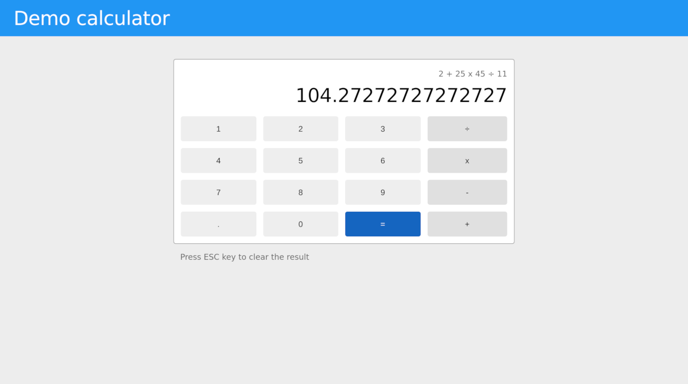

## Demo calculator

This application shows how to build a calculator in JavaScript.

The source code explains line-by-line of how to build a calculator. Use this for education to learn how to build application logic and UI around it.



[See application demo page](https://jarrodek.github.io/demo-calculator/dist/index.html)

### Running the app

Clone repository

```sh
git clone https://github.com/jarrodek/demo-calculator
cd demo-calculator
npm install
```

Now run the application:

```sh
npm start
```

### Running the tests
```sh
npm test
```
